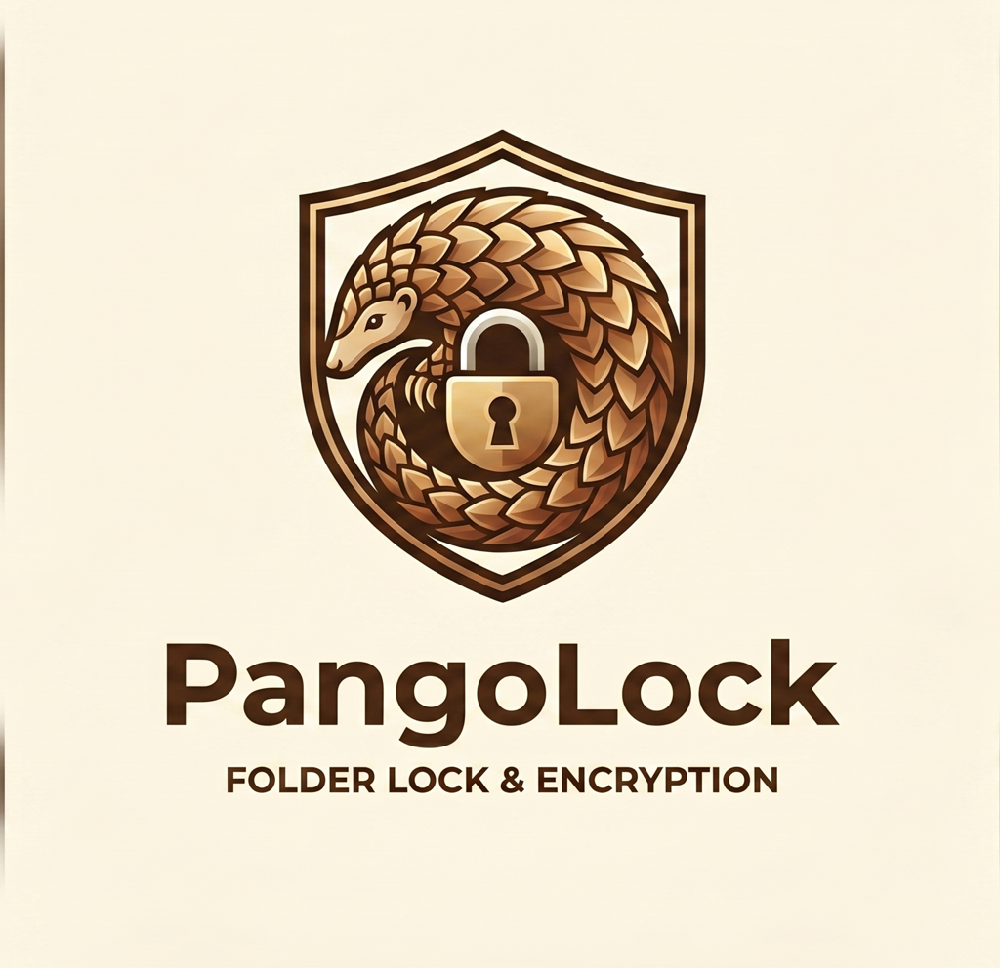

<div align="center">



# PangoLock

**Hide and password-lock any folder on your Mac — like a pangolin curling into an armored ball.**

[](https://github.com/OWNER/PangoLock/actions/workflows/ci.yml)
[](LICENSE)
[](#requirements)
[](#requirements)

**100% free & open source. Every feature. No paywall, no premium tier, no account.**

</div>

---

PangoLock is a native macOS app that hides and **AES‑256 encrypts** your private
folders and files behind a master password — with a zero‑knowledge design where
your password is never stored and your data is encrypted at rest.

## Features

- 🔒 **Lock & encrypt** unlimited folders with **AES‑256‑GCM**; optional per‑folder password.
- 🙈 **Hide & show** items from Finder with one click (or drag‑and‑drop to add).
- 🔑 **Zero‑knowledge master password** (PBKDF2‑210k); **Touch ID** unlock; idle auto‑lock.
- 🧯 **Fail‑safe by design** — verify‑before‑delete, atomic writes, journaled moves: an interrupted operation never loses data.
- 🛟 **Recovery key** for a forgotten password; **encrypted backups**; **export everything** so deleting the app never strands your data.
- 💳 **Encrypted wallet** for logins, cards, notes & licenses, with a strong‑password generator.
- 💾 **Portable USB lockers** (`.pangolocker`) and **encrypted sharing** (`.pangoshare`, with a password hint).
- 🕵️ **Intruder snapshot** after repeated failed unlocks (opt‑in), **stealth mode** (hide Dock icon), and **panic** lock‑&‑hide.
- 🧹 **Secure shredder** and **trace cleaner**; **cloud‑awareness** warnings for iCloud/Dropbox/Drive/OneDrive paths.

## Security

PangoLock encrypts everything at rest with **AES‑256‑GCM**, derives keys with
**PBKDF2‑HMAC‑SHA256 (210,000 iterations)**, stores secrets in the macOS
**Keychain**, runs in the **App Sandbox**, and makes **no logging calls** that
could leak secrets. The full threat model — including what PangoLock does *not*
defend against — lives in **[SECURITY.md](SECURITY.md)**. Architecture details
are in **[docs/ARCHITECTURE.md](docs/ARCHITECTURE.md)**.

> Honest positioning: PangoLock protects your data **at rest** on your Mac. It is
> not a defense against a fully compromised or root‑level‑owned machine.

## Requirements

- macOS 13 (Ventura) or later — universal (Apple Silicon + Intel)
- Xcode 16+ / Swift 5.9+ to build from source

## Build & run

```bash
git clone https://github.com/OWNER/PangoLock.git
cd PangoLock
xcodebuild build -project PangoLock.xcodeproj -scheme PangoLock \
  -configuration Debug -destination 'platform=macOS' \
  CODE_SIGNING_ALLOWED=NO -derivedDataPath build
open build/Build/Products/Debug/PangoLock.app
```

Run the tests:

```bash
xcodebuild test -project PangoLock.xcodeproj -scheme PangoLock \
  -destination 'platform=macOS' CODE_SIGNING_ALLOWED=NO -derivedDataPath build
```

For signing, notarization, and producing a release DMG, see
**[docs/RELEASING.md](docs/RELEASING.md)**.

## Contributing

Contributions are welcome! Please read **[CONTRIBUTING.md](CONTRIBUTING.md)**.
Security issues should be reported privately — see [SECURITY.md](SECURITY.md).

## Support the project

PangoLock is free forever. If it protects something you care about, please
**⭐ star the repo** and consider **[sponsoring](https://github.com/sponsors/OWNER)**
to support ongoing development. Donations only — never a paywall.

## License

[MIT](LICENSE) © PangoLock contributors. The pangolin mascot/icon is part of this
project and shared under the same license.
